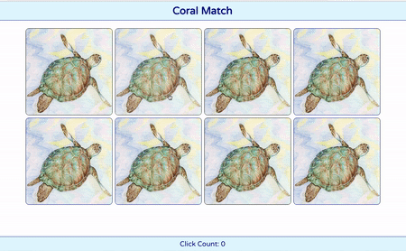
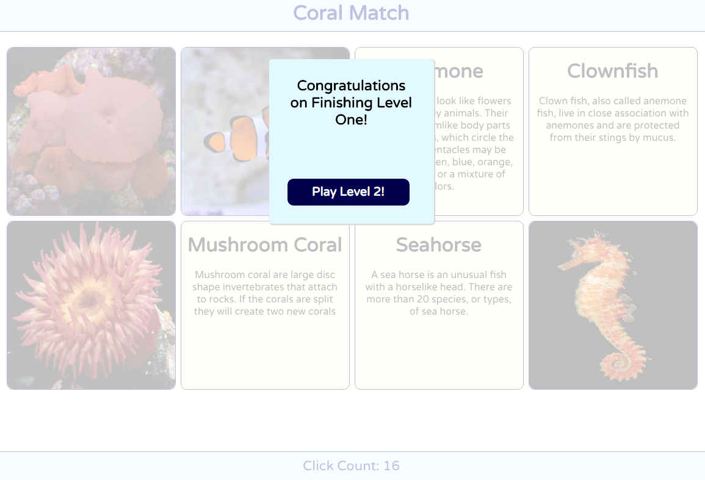

# Coral Match
Coral Match is an educational version of the well known card matching game. The purpose is to help users in learning about different types of saltwater corals, invertebrates, and fish through a fun, interactive and challenging game.

One card has a photo of the saltwater creature and the matching card will have a brief description and the name of the creature. The user will flip cards arranged on the screen looking for pairs of matching images. Once a pair has been found the cards will remain flipped. After all pairs have been found the user will be able to play the next level with different animals.

## Technology Used
The app was built using only React.js.  I utilized the creat-react-app package library to handle creating all the boilerplate and setup. The card flipping was handled using React onChange event handlers and CSS transitions.

## Example Game Play

## Level Completion Modal
When all cards have been matched a modal pops up that directs the user to the next level.

